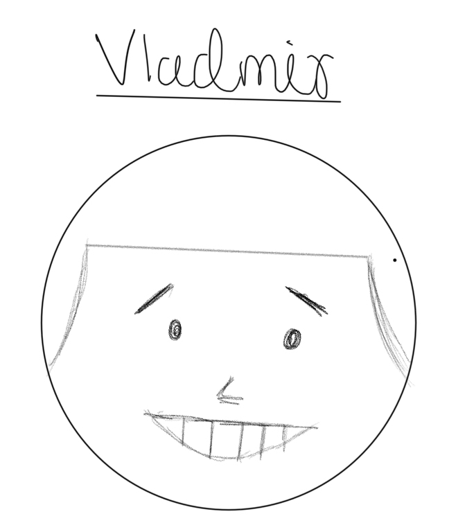
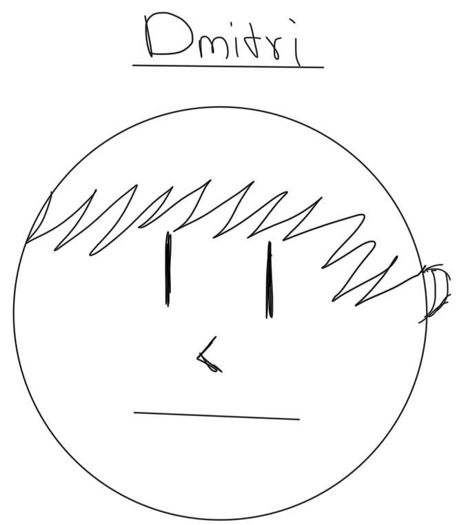
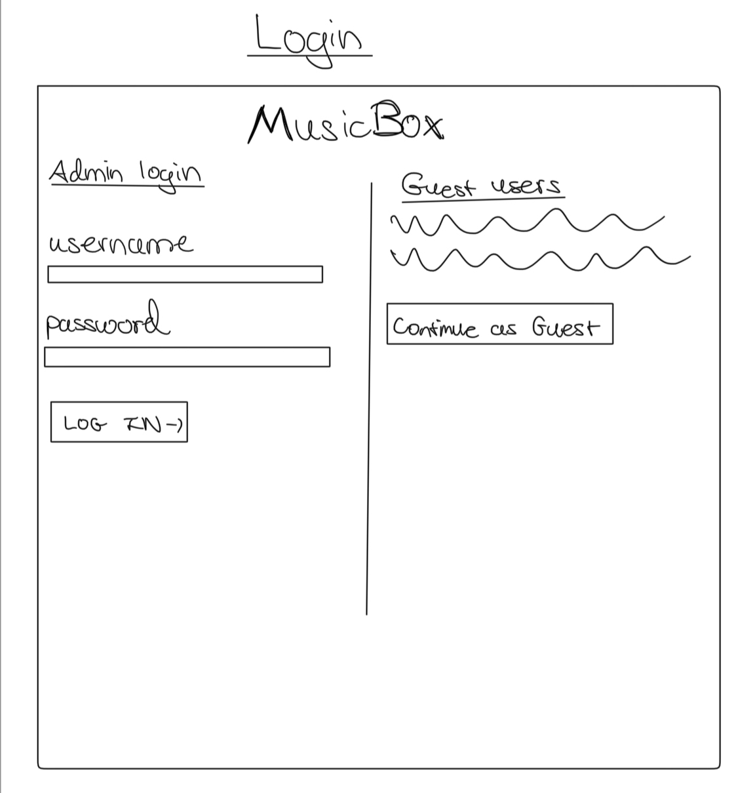
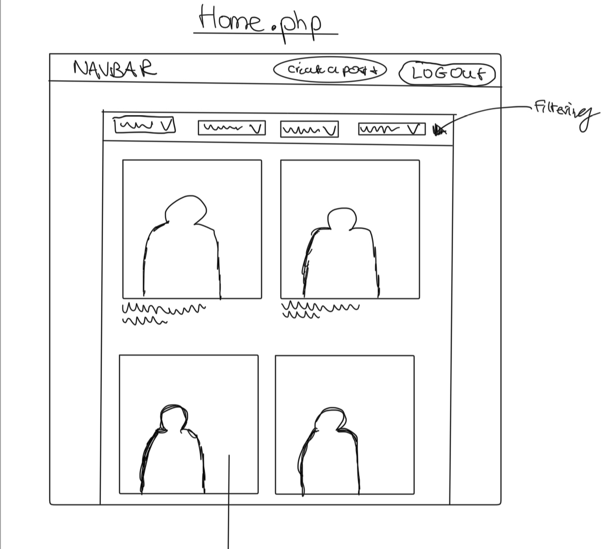
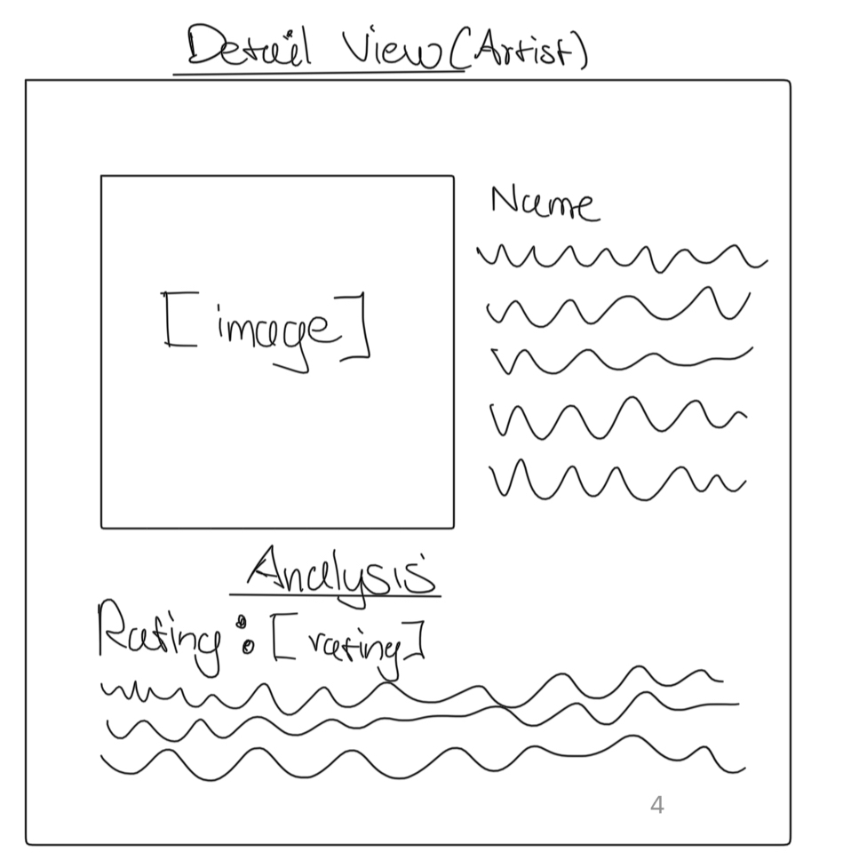
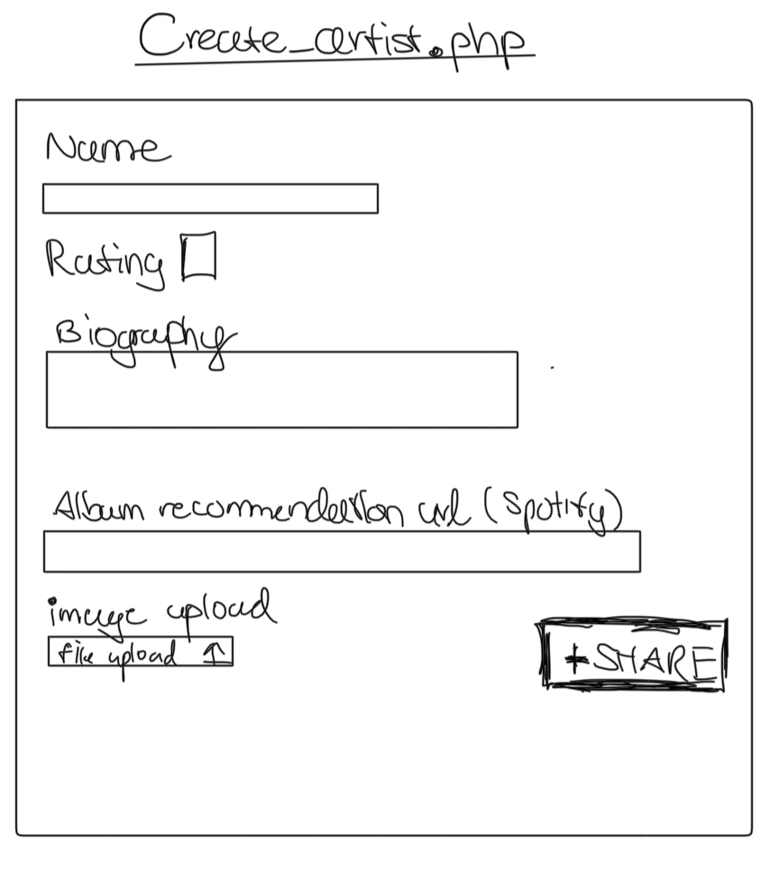
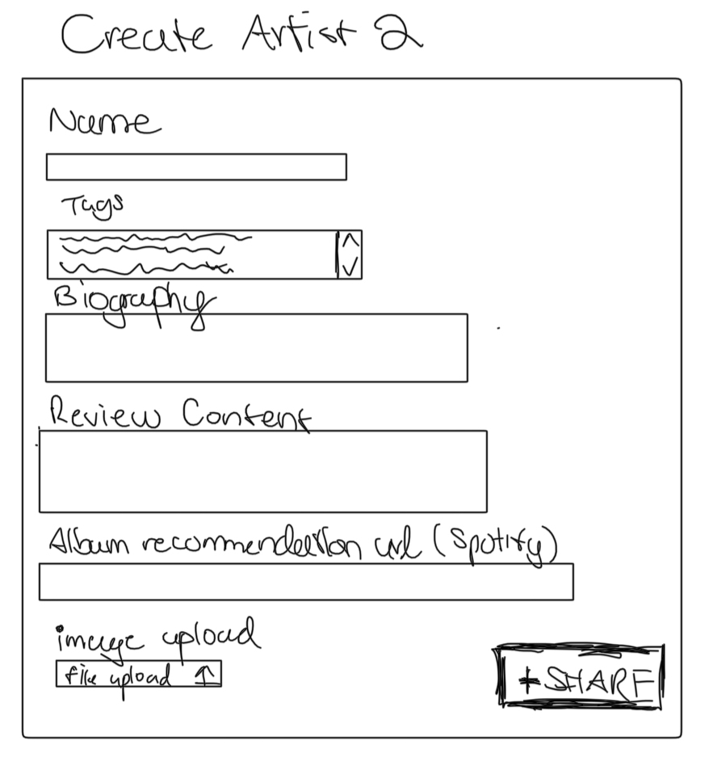
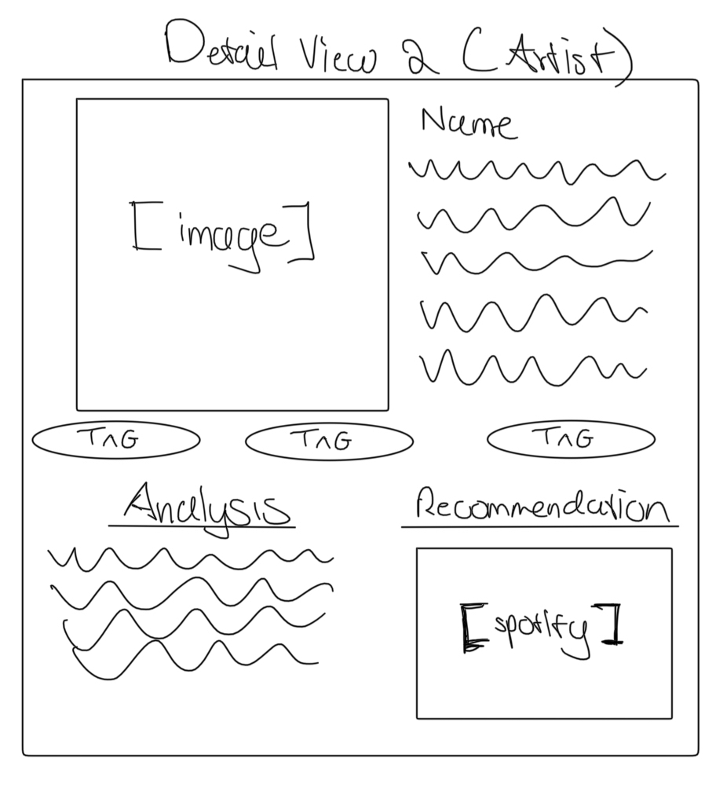

# Project 3: Design Journey

**For each milestone, complete only the sections that are labeled with that milestone.** Refine all sections before the final submission.

You are graded on your design process. If you later need to update your plan, **do not delete the original plan, rather leave it in place and append your new plan _below_ the original.** Then explain why you are changing your plan. Any time you update your plan, you're documenting your design process!

**Replace ALL _TODOs_ with your work.** (There should be no TODOs in the final submission.)

Be clear and concise in your writing. Bullets points are encouraged.

**Everything, including images, must be visible in _Markdown: Open Preview_.** If it's not visible in the Markdown preview, then we can't grade it. We also can't give you partial credit either. **Please make sure your design journey should is easy to read for the grader;** in Markdown preview the question _and_ answer should have a blank line between them.


## Design Plan (Milestone 1)

**Make the case for your decisions using concepts from class, as well as other design principles, theories, examples, and cases from outside of class (includes the design prerequisite for this course).**

You can use bullet points and lists, or full paragraphs, or a combo, whichever is appropriate. The writing should be solid draft quality.


### Catalog (Milestone 1)
> What will your catalog website be about? (1 sentence)

Musical Artists (and their work)


### _Consumer_ Audience (Milestone 1)
> Briefly explain your site's _consumer_ audience. Your audience should be specific, but not arbitrarily specific. (1 sentence)
> Justify why this audience is a **cohesive** group. (1-2 sentences)

Music enthustiasts (and neophites)

### _Consumer_ Audience Goals (Milestone 1)
> Document your _consumer_ audience's goals for using this catalog website.
> List each goal below. There is no specific number of goals required for this, but you need enough to do the job (Hint: It's more than 1. But probably not more than 3.)
> **Hint:** Users will be able to view all entries in the catalog and insert new entries into the catalog. The audience's goals should probably relate to these activities.

Goal 1: Expose users to new categories of music

- **Design Ideas and Choices** _How will you meet those goals in your design?_
  - A home page that lists kinds of music along with a filtering system
- **Rationale & Additional Notes** _Justify your decisions; additional notes._
  - A home page allows users to explore and select different kinds of content in one place.

Goal 2: Deepen understanding of already explored categories of music
- **Design Ideas and Choices** _How will you meet those goals in your design?_
  - For each artist listed in the media catalog, there will be a detailed view for that artist
- **Rationale & Additional Notes** _Justify your decisions; additional notes._
  - Having such a detail view allows users to learn more about a particular artist, including their background and work.

### _Consumer_ Audience Device (Milestone 1)
> How will your _consumer_ audience access this website? From a narrow (phone) or wide (laptop) device?
> Justify your decision. (1 sentence)

- wide (laptop) device
  - Using a wide device will allow users to view more artists at once, avoiding high amounts of scrolling potentially involved with a mobile client

### _Consumer_ Persona (Milestone 1)
> Use the goals you identified above to develop a persona of your site's _consumer_ audience.
> Your persona must have a name and a face. The face can be a photo of a face or a drawing, etc.

- Vladmir
  - 

**Factors that Influence Behavior:**
- Cultural interests of peers, time commitments
- Geography (at both the national and local level)
- Age

**Goals:**
- Be exposed to new music
- Learn more about his favorite artists

**Obstacles:**
- Doesn't want to read too much content (ex: Wikipedia article/essay)

**Desires:**
- Wants audio and visual content

### _Administrator_ Audience (Milestone 1)
> Briefly explain your site's _administrator_ audience. Your audience should be specific, but not arbitrarily specific. (1 sentence)
> Justify why this audience is a **cohesive** group. (1-2 sentences)

- Music pundits (the kind that like to expose people ot new music)

- Despite not having exactly the same tastes in music, the typical administrator to this site will share a love of music with other administrators.


### _Administrator_ Audience Goals (Milestone 1)
> Document your _administrator_ audience's goals for using this catalog website.
> List each goal below. There is no specific number of goals required for this, but you need enough to do the job (Hint: It's more than 1. But probably not more than 3.)
> **Hint:** Users will be able to view all entries in the catalog and insert new entries into the catalog. The audience's goals should probably relate to these activities.

Goal 1: Expose others to music that other people will find interesting

- **Design Ideas and Choices** _How will you meet those goals in your design?_
  - Use a form to allow admins to post artists that they think are worthwhile
- **Rationale & Additional Notes** _Justify your decisions; additional notes._
  - With this form, we are directly giving admins the power to release content to users of the site

Goal 2: Allow admins to categorize/organize existing artists according to some criteria
- **Design Ideas and Choices** _How will you meet those goals in your design?_
  - Within the form that allows artists to be posted, there will be options that will allow the admin to categorize artists
- **Rationale & Additional Notes** _Justify your decisions; additional notes._
  - In a single form, we will allow admins to be able to categorize the content they want to share with others.

### _Administrator_ Persona (Milestone 1)
> Use the goals you identified above to develop a persona of your site's _administrator_ audience.
> Your persona must have a name and a face. The face can be a photo of a face or a drawing, etc.

- Dmitri
  - 

**Factors that Influence Behavior:**
- Available time (to use computer devices)
- Age
**Goals:**
- Spend some time each week sharing and categorizing content shared with others
**Obstacles:**
- Lacks social network reach in order to do this himself

**Desires:**
- An low-effort method of sharing content with others


### Catalog Data (Milestone 1)
> Using your personas, identify the data you need to include in the catalog for your site's audiences.
> Justify why this data aligns with your persona's goals. (1 sentence)

- Artist Name
- Genre(s)
- Album recommendation (spotify)
- Biography
- Rating (from admin)

- Note: The above information will be split into different tables


- For Dmitri (typical admin), this data will allow him to communicate his favorite work, overall rating, and objective information regarding a particular artist of interest.
- For Vladmir (typical consumer), He will be on the receiving end of this communication being exposed to what might be his next favorite artist.


### Site Design (Milestone 1)
> Design your catalog website to address the goals of your personas.
> Sketch your site's design:
>
> - These are **design** sketches, not _planning_ sketches.
> - Use text in the sketches to help us understand your design.
> - Where the content of the text is unimportant, you may use squiggly lines for text.
> - **Do not label HTML elements or annotate CSS classes.** This is not a planning sketch.
>
> Provide a brief explanation _underneath_ each sketch. (1 sentence)
> **Refer to your persona by name in each explanation.**
>
  - Login
    - 
> - Home:
>   - 
>
> - Detail View of Artist
>   - 
>
> - Create Artist
>   - 
>
>
  - 2nd iteration of designs
    - New Create Artist View
      - 
    - New Artist View (detail view of artist)
      - 

- 1st Iteration Explanations
  - Login (/login)
    - This login page allows Dmitri to access admin controls in a quick, organized way. For Vladmir, this page offers information about how to use the cite given his use case.
  - Home (/)
    - Uses a grid-type format that will allow Vladmir to scan the page for new artists
  - Detail View of Artist (/detail)
    - This page allows Vladmir to gain more information about a particular artist, or offers the chance to learn something new about that artist. Furthermore, this will let Dmitri (admin) to quickly view a post and be deleted if necessary.
  - Create Artist (/create_artist)
    - This form will allow Dmitri to share content with consumers, and by proxy is what allows the site to perform its function for regular users like Vladmir

- 2nd Iteration Explanations
  - New Create Artist View
    - Content has been altered to allow any tags to exist within the form, something the original design wasn't capable of
      - Country, Rating fields deleted, Tags field added
  - New Detail View of Artist
      - Tags added: Will allow Dmitri or Vladmir to navigate to other artists within a tag directly from a detail page of an artist, facilitating discovery
      - Spotify Recommendation section added to further immersion and add ease of access to an artist's work (labelling self-explanatory)


### Catalog Design Patterns (Milestone 1)
> Explain how you used design patterns in your site's design. (1-2 sentences)

This website uses a 'thumbnail grid' of entries on its home page, features a list of 'tags' to be applied to filter
through said entries, and has a "detail" page for each artist.


## Implementation Plan (Milestone 1, Milestone 2, Milestone 3, Final Submission)

### Database Schema (Milestone 1)
> Plan the structure of your database. You may use words or a picture.
> A bulleted list is probably the simplest way to do this.
> Make sure you include constraints for each field.

Table: artists
- id: INT {NN, U, AI, PK}
- name: TEXT {NN},
- bio: TEXT {},

Table: reviews
- id: INT {NN, U, AI, PK}
- content: TEXT {NN}
- rating: INT {NN}
- album_rec_url: TEXT {}

### Database Query Plan (Milestone 1, Milestone 2, Milestone 3, Final Submission)
> Plan _all_ of your database queries.
> You may use natural language, pseudocode, or SQL.

```
SELECT * FROM artists

--Selecting info for particular artist

SELECT * FROM artists WHERE artists.id = ".($id_param)
```

```
SELECT * FROM reviews

SELECT artists.id AS 'artists.id', artists.name AS 'artists.name', artists.bio AS 'artists.bio'
FROM artist INNER JOIN reviews ON (artists.id=reviews.id);

(Similar above query for filtering system)


```

## Complete & Polished Website (Final Submission)

### Accessibility Audit (Final Submission)
> Tell us what issues you discovered during your accessibility audit.
> What do you do to improve the accessibility of your site?

Labels had unnecessary name attributes, and closing tags for input tags were removedon detail page (HTML Validator)
Some label ids weren't properly implemented on the create artist page


### Self-Reflection (Final Submission)
> Reflect on what you learned during this assignment. How have you improved from Projects 1 and 2?

I've learned a lot about how write complex, yet secure SQL queries. Furthermore, I've only improved in my ability to use a layout.
Also, I've been more thorough in my design process in terms of documentation. Lastly, I'm better at meeting project requirements and
deadlines overall.


> Take some time here to reflect on how much you've learned since you started this class. It's often easy to ignore our own progress. Take a moment and think about your accomplishments in this class. Hopefully you'll recognize that you've accomplished a lot and that you should be very proud of those accomplishments! (1-3 sentences)

I learned 2 new languages: SQL and PHP. I learned how to interate GitHub within VS Code and use Docker with it (securely). Also, I've learned a bit more about
what it takes to use code that you didn't personally write from scratch in order to build a larger project.

### Collaborators (Final Submission)
> List any persons you collaborated with on this project.

- N/A

### Reference Resources (Final Submission)
> Please cite any external resources you referenced in the creation of your project.
> (i.e. W3Schools, StackOverflow, Mozilla, etc.)

- https://www.php.net/docs.php
- https://developer.mozilla.org/en-US/docs/Mozilla/Firefox


### Grading: User Accounts (Final Submission)
> The graders will need to log in to your website.
> Please provide the usernames and passwords.

**Administrator User:**

- Username: admin
- Password: monkey

- Username: admin2
- Password: monkey

**Consumer User:**
- This website does not support consumer log in

**Note:** Not all websites will support consumer log in. If your website doesn't, say so.


### Grading: Step-by-Step Instructions (Final Submission)
> Write step-by-step instructions for the graders.
> The project if very hard to grade if we don't understand how your site works.
> For example, you must log in before you can delete.
> For each set of instructions, assume the grader is starting from /

_View all entries:_
1. Simply access the home page (URL: "/")

_View all entries for a tag:_

1. Navigate to home page
2. View dropdowns under navbar
3. Select a dropdown-item from any dropdown under the navbar

_View a single entry's details:_

1. Navigate to home page
2. Click on any particular entry (card element)

_How to insert and upload a new entry:_

1. Login via the blue "Login" button on the right hand side in the NavBar. (if not logged in already)
2. Click the gray "Add an Artist +" button that appears in the navbar.
3. Fill out the form on the page, and click submit

_How to delete an entry:_
1. Navigate to any entry's detail page (steps above)
2. Click the red "delete" button next to the artists' name
   1. (You will now be redirected to the home page)
